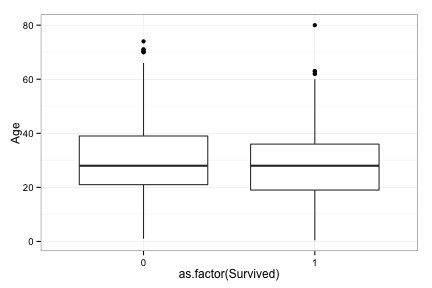

## Background  
This is an entry for the kaggle machine learning competition [Titanic: Machine Learning from Disaster](https://www.kaggle.com/c/titanic-gettingStarted)

#### Introduction from kaggle's website:  
> The sinking of the RMS Titanic is one of the most infamous shipwrecks in history.  On April 15, 1912, during her maiden voyage, the Titanic sank after colliding with an iceberg, killing 1502 out of 2224 passengers and crew. This sensational tragedy shocked the international community and led to better safety regulations for ships.  

> One of the reasons that the shipwreck led to such loss of life was that there were not enough lifeboats for the passengers and crew. Although there was some element of luck involved in surviving the sinking, some groups of people were more likely to survive than others, such as women, children, and the upper-class.  

> In this challenge, we ask you to complete the analysis of what sorts of people were likely to survive. In particular, we ask you to apply the tools of machine learning to predict which passengers survived the tragedy.  

> This Kaggle "Getting Started" Competition provides an ideal starting place for people who may not have a lot of experience in data science and machine learning. The data is highly structured, and we provide tutorials of increasing complexity for using Excel, Python, pandas in Python, and a Random Forest in Python (see links in the sidebar). We also have links to tutorials using R instead. Please use the forums freely and as much as you like. There is no such thing as a stupid question; we guarantee someone else will be wondering the same thing!  

#### Method:  
1. Load the data  
2. Perform exploratory analysis  
3. Propose hypothesis  
4. Create model reflective of the hypothesis  
5. Submit model prediction result  
6. Repeat steps 3 through 5 until reaching the limit of accuracy improvement  

#### Reference:  
http://trevorstephens.com/post/72920580937/titanic-getting-started-with-r-part-2-the

## Summary  


## Detailed analysis  

#### Load the data

```r
train <- read.csv("train.csv")
head(train)
```

```
##   PassengerId Survived Pclass
## 1           1        0      3
## 2           2        1      1
## 3           3        1      3
## 4           4        1      1
## 5           5        0      3
## 6           6        0      3
##                                                  Name    Sex Age SibSp
## 1                             Braund, Mr. Owen Harris   male  22     1
## 2 Cumings, Mrs. John Bradley (Florence Briggs Thayer) female  38     1
## 3                              Heikkinen, Miss. Laina female  26     0
## 4        Futrelle, Mrs. Jacques Heath (Lily May Peel) female  35     1
## 5                            Allen, Mr. William Henry   male  35     0
## 6                                    Moran, Mr. James   male  NA     0
##   Parch           Ticket   Fare Cabin Embarked
## 1     0        A/5 21171  7.250              S
## 2     0         PC 17599 71.283   C85        C
## 3     0 STON/O2. 3101282  7.925              S
## 4     0           113803 53.100  C123        S
## 5     0           373450  8.050              S
## 6     0           330877  8.458              Q
```

```r
## how many observations 
nrow(train)
```

```
## [1] 891
```

```r
## how many features
ncol(train)
```

```
## [1] 12
```

```r
## how many survived and their percentage
nrow(train[train$Survived==1,]) / nrow(train)
```

```
## [1] 0.3838
```
About 38.4% of passengers survived. Let's examine survival rate in relationship to passengers' demographic attributes. First, start with age and survival rate.  

```r
library(ggplot2)
ggplot(train, aes(as.factor(Survived),Age)) + geom_boxplot() + theme_bw()
```

```
## Warning: Removed 177 rows containing non-finite values (stat_boxplot).
```

 
From a galance, there doens't seem to have a strong difference in age between survivors and victims. Let's look at sex next.  


```r
table(train$Sex)
```

```
## 
## female   male 
##    314    577
```

```r
table(train$Sex, train$Survived)  
```

```
##         
##            0   1
##   female  81 233
##   male   468 109
```

```r
##  seems like females are more likely to sruvive, let's look at the proportions:
prop.table(table(train$Sex, train$Survived), 1)
```

```
##         
##               0      1
##   female 0.2580 0.7420
##   male   0.8111 0.1889
```
74% of females survived, versus only 19% for males.   

Now let's get back to the ages.  

```r
summary(train$Age)
```

```
##    Min. 1st Qu.  Median    Mean 3rd Qu.    Max.    NA's 
##    0.42   20.10   28.00   29.70   38.00   80.00     177
```

```r
## there are several NAs. Let's clean them up by replacing them with the average age of all passengers  
yesAge <- train[!is.na(train$Age),]
train[is.na(train$Age),"Age"] <- mean(yesAge$Age)
```
Here, the assumption is that women and children had priority access to lifeboats and life vests. The question is how young should a child be to be considered eligible for that treatment? Let's use a for loop, starting from the age 18, and compare the difference of the survival rates between boys and girls, if we found an age group with almost equal survival rate between both genders, we have found the threadshold.  


```r
for (i in 2:18) {
    ageTemp <- subset(train, Age < i)
    prop.table(table(ageTemp$Sex, ageTemp$Survived),1)
    diff <- prop.table(table(ageTemp$Sex, ageTemp$Survived),1)[1,2]-prop.table(table(ageTemp$Sex, ageTemp$Survived),1)[2,2]
    print(paste("Age", i, "survival diff: ", diff))
}
```

```
## [1] "Age 2 survival diff:  0.2"
## [1] "Age 3 survival diff:  -0.0428571428571429"
## [1] "Age 4 survival diff:  -0.138888888888889"
## [1] "Age 5 survival diff:  0.0537084398976982"
## [1] "Age 6 survival diff:  0.109730848861284"
## [1] "Age 7 survival diff:  0.072463768115942"
## [1] "Age 8 survival diff:  0.134615384615385"
## [1] "Age 9 survival diff:  0.123626373626374"
## [1] "Age 10 survival diff:  0.0395833333333333"
## [1] "Age 11 survival diff:  0.0371456500488758"
## [1] "Age 12 survival diff:  0.0381944444444444"
## [1] "Age 13 survival diff:  0.0261824324324325"
## [1] "Age 14 survival diff:  0.0500794912559619"
## [1] "Age 15 survival diff:  0.076923076923077"
## [1] "Age 16 survival diff:  0.126162790697674"
## [1] "Age 17 survival diff:  0.242096838735494"
## [1] "Age 18 survival diff:  0.29435736677116"
```
It seems like age 15 is the threashold -- younger than 15, regardless boy or girl, the person was considered a child and given priority; older than 15, the person was considered an adult, a woman or a man, and was treated accordingly. 


```r
age15 <- subset(train, Age < 15)
table(age15$Sex, age15$Survived)
```

```
##         
##           0  1
##   female 15 24
##   male   18 21
```

```r
prop.table(table(age15$Sex, age15$Survived), 1)
```

```
##         
##               0      1
##   female 0.3846 0.6154
##   male   0.4615 0.5385
```
Children younger than 15 had a survival rate higher than 54%, much better than the average of 38%. Now let's look at class and fare.  


```r
table(train$Pclass, train$Survived)
```

```
##    
##       0   1
##   1  80 136
##   2  97  87
##   3 372 119
```

```r
prop.table(table(train$Pclass, train$Survived),1)
```

```
##    
##          0      1
##   1 0.3704 0.6296
##   2 0.5272 0.4728
##   3 0.7576 0.2424
```

```r
## it seems that the higher the class, the more likely to survive; the hypothesis is that class was associated to social status.
cor(train$Pclass, train$Survived)
```

```
## [1] -0.3385
```

```r
lm(train$Pclass ~ train$Survived)
```

```
## 
## Call:
## lm(formula = train$Pclass ~ train$Survived)
## 
## Coefficients:
##    (Intercept)  train$Survived  
##          2.532          -0.582
```

```r
##  a linear regression is detected with correlation -0.33.
```

If class level is associated to social status, and thus associated to survival rate, let's compare class level to the fare to see if we can find anything new.   


```r
hist(train$Fare)
```

 

Majority of the passengers purchased a ticket cheaper than $100; how many passengers actually purchased an expensive ticket?  


```r
nrow(subset(train, Fare >= 100)) / nrow(train)
```

```
## [1] 0.05948
```

```r
nrow(subset(train, Fare >= 100))
```

```
## [1] 53
```
6%, or 53 passengers purchased an expensive ticket. Did they have better survival rate, since they were likely well-off, thus likely with higher social status?  


```r
ballerz <- subset(train, Fare >= 100)
prop.table(table(ballerz$Survived))
```

```
## 
##      0      1 
## 0.2642 0.7358
```
Yes, passengers able to afford an expensive ticket (>$100) had a survival rate of 74%, much higher than average, even much higher than the survival rate of children.   

Now just to confirm -- did those wealthy passengers all stayed at higher classes?  


```r
table(ballerz$Pclass)
```

```
## 
##  1 
## 53
```

Yes, all of them were riding first class.  

#### Learnings so far:  
1. Females had higher survival rate than men;  
2. Children under the age of 15 had higher survival rate than average, regardless of gender;  
3. Passengers with a ticket fare higher than $100 mostly survived;  

We can apply those learnings to our next submission.  

First, assume all children under the age of 15 survived.  

```r
test <- read.csv("test.csv")
## create a column "Survived"
test$Survived <- 0
test[test$Age < 15 & !is.na(test$Age),]$Survived <- 1
```

Second, among those older than 15, find the ones that paid more than $100 for their fare and assume them survived.  


```r
test[test$Survived == 0 & test$Fare > 100 & !is.na(test$Fare),]$Survived <- 1
```

Finally, among the rest of the passengers, assume all women survived.  


```r
test[test$Survived == 0 & test$Sex == "female",]$Survived <- 1
```

Now we have the final prediction for this round, let's clean it up and upload.  


```r
result1 <- subset(test, select=c(PassengerId, Survived))
```


