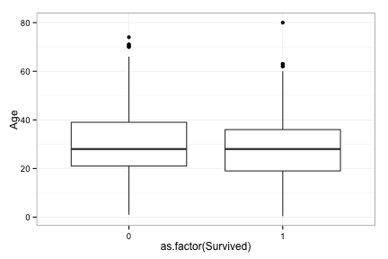
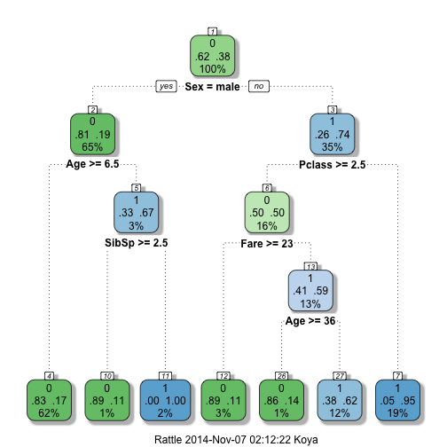
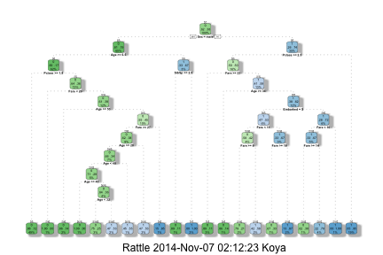
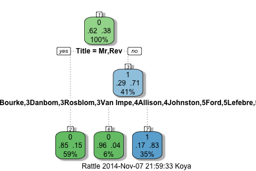
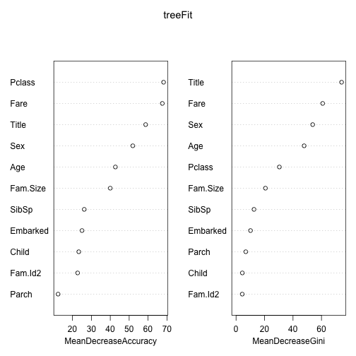

## Background  
This is an entry for the kaggle machine learning competition [Titanic: Machine Learning from Disaster](https://www.kaggle.com/c/titanic-gettingStarted)

#### Introduction from kaggle's website:  
> The sinking of the RMS Titanic is one of the most infamous shipwrecks in history.  On April 15, 1912, during her maiden voyage, the Titanic sank after colliding with an iceberg, killing 1502 out of 2224 passengers and crew. This sensational tragedy shocked the international community and led to better safety regulations for ships.  

> One of the reasons that the shipwreck led to such loss of life was that there were not enough lifeboats for the passengers and crew. Although there was some element of luck involved in surviving the sinking, some groups of people were more likely to survive than others, such as women, children, and the upper-class.  

> In this challenge, we ask you to complete the analysis of what sorts of people were likely to survive. In particular, we ask you to apply the tools of machine learning to predict which passengers survived the tragedy.  

> This Kaggle "Getting Started" Competition provides an ideal starting place for people who may not have a lot of experience in data science and machine learning. The data is highly structured, and we provide tutorials of increasing complexity for using Excel, Python, pandas in Python, and a Random Forest in Python (see links in the sidebar). We also have links to tutorials using R instead. Please use the forums freely and as much as you like. There is no such thing as a stupid question; we guarantee someone else will be wondering the same thing!  

#### Method:  
1. Load the data  
2. Perform exploratory analysis  
3. Propose hypothesis  
4. Create model reflective of the hypothesis  
5. Submit model prediction result  
6. Repeat steps 3 through 5 until reaching the limit of accuracy improvement  

#### Reference:  
http://trevorstephens.com/post/72920580937/titanic-getting-started-with-r-part-2-the

## Summary  


## Detailed analysis  

#### Load the data

```r
train <- read.csv("train.csv")
test <- read.csv("test.csv")
head(train)
```

```
##   PassengerId Survived Pclass
## 1           1        0      3
## 2           2        1      1
## 3           3        1      3
## 4           4        1      1
## 5           5        0      3
## 6           6        0      3
##                                                  Name    Sex Age SibSp
## 1                             Braund, Mr. Owen Harris   male  22     1
## 2 Cumings, Mrs. John Bradley (Florence Briggs Thayer) female  38     1
## 3                              Heikkinen, Miss. Laina female  26     0
## 4        Futrelle, Mrs. Jacques Heath (Lily May Peel) female  35     1
## 5                            Allen, Mr. William Henry   male  35     0
## 6                                    Moran, Mr. James   male  NA     0
##   Parch           Ticket    Fare Cabin Embarked
## 1     0        A/5 21171  7.2500              S
## 2     0         PC 17599 71.2833   C85        C
## 3     0 STON/O2. 3101282  7.9250              S
## 4     0           113803 53.1000  C123        S
## 5     0           373450  8.0500              S
## 6     0           330877  8.4583              Q
```

```r
## how many observations 
nrow(train)
```

```
## [1] 891
```

```r
## how many features
ncol(train)
```

```
## [1] 12
```

```r
## how many survived and their percentage
nrow(train[train$Survived==1,]) / nrow(train)
```

```
## [1] 0.3838384
```

About 38.4% of passengers survived. Let's examine survival rate in relationship to passengers' demographic attributes. First, start with age and survival rate.  

```r
library(ggplot2)
ggplot(train, aes(as.factor(Survived),Age)) + geom_boxplot() + theme_bw()
```

```
## Warning: Removed 177 rows containing non-finite values (stat_boxplot).
```

 

From a galance, there doens't seem to have a strong difference in age between survivors and victims. Let's look at sex next.  

### Gender Model:  


```r
table(train$Sex)
```

```
## 
## female   male 
##    314    577
```

```r
table(train$Sex, train$Survived)  
```

```
##         
##            0   1
##   female  81 233
##   male   468 109
```

```r
##  seems like females are more likely to sruvive, let's look at the proportions:
prop.table(table(train$Sex, train$Survived), 1)
```

```
##         
##                  0         1
##   female 0.2579618 0.7420382
##   male   0.8110919 0.1889081
```
74% of females survived, versus only 19% for males.  

#### Round 1 submission:  
Assume all females survived, and all males died.  

#### Round 1 submission result:  
This model had an accuracy of 0.76555.  

### Gender, Class, Fare, and Children Model:  


Now let's get back to the ages.  

```r
summary(train$Age)
```

```
##    Min. 1st Qu.  Median    Mean 3rd Qu.    Max.    NA's 
##    0.42   20.12   28.00   29.70   38.00   80.00     177
```

```r
## there are several NAs. Let's clean them up by replacing them with the average age of all passengers  
yesAge <- train[!is.na(train$Age),]
train[is.na(train$Age),"Age"] <- mean(yesAge$Age)
```
Here, the assumption is that women and children had priority access to lifeboats and life vests. The question is how young should a child be to be considered eligible for that treatment? Let's use a for loop, starting from the age 18, and compare the difference of the survival rates between boys and girls, if we found an age group with almost equal survival rate between both genders, we have found the threadshold.  

**Update:** This finding was later confirmed by my reserach on [Wikipedia](http://en.wikipedia.org/wiki/RMS_Titanic#Survivors_and_victims). According to the table, there were 109 children in total, since we only have a portion of the data (train), we can calculate the ratio of observation data in the training set versus the complete dataset.  


```r
rate <- nrow(train) / (nrow(train) + nrow(test))
```

We have about 68% of all observations, meaning the number of children in our training dataset should follow the same ratio.  


```r
rate * 109
```

```
## [1] 74.19328
```

We should have about 74 children in our training dataset. Let's verify that with our 15 thredshold.  


```r
nrow(train[train$Age < 15,])
```

```
## [1] 78
```
78, very close to the number 74. 15 is the correct threshold. According to the table, 100% of children stayed in second class survived. We will apply this learning later.  

**Update over**  


```r
for (i in 2:18) {
    ageTemp <- subset(train, Age < i)
    prop.table(table(ageTemp$Sex, ageTemp$Survived),1)
    diff <- prop.table(table(ageTemp$Sex, ageTemp$Survived),1)[1,2]-prop.table(table(ageTemp$Sex, ageTemp$Survived),1)[2,2]
    print(paste("Age", i, "survival diff: ", diff))
}
```

```
## [1] "Age 2 survival diff:  0.2"
## [1] "Age 3 survival diff:  -0.0428571428571429"
## [1] "Age 4 survival diff:  -0.138888888888889"
## [1] "Age 5 survival diff:  0.0537084398976982"
## [1] "Age 6 survival diff:  0.109730848861284"
## [1] "Age 7 survival diff:  0.072463768115942"
## [1] "Age 8 survival diff:  0.134615384615385"
## [1] "Age 9 survival diff:  0.123626373626374"
## [1] "Age 10 survival diff:  0.0395833333333333"
## [1] "Age 11 survival diff:  0.0371456500488758"
## [1] "Age 12 survival diff:  0.0381944444444444"
## [1] "Age 13 survival diff:  0.0261824324324325"
## [1] "Age 14 survival diff:  0.0500794912559619"
## [1] "Age 15 survival diff:  0.076923076923077"
## [1] "Age 16 survival diff:  0.126162790697674"
## [1] "Age 17 survival diff:  0.242096838735494"
## [1] "Age 18 survival diff:  0.29435736677116"
```
It seems like age 15 is the threashold -- younger than 15, regardless boy or girl, the person was considered a child and given priority; older than 15, the person was considered an adult, a woman or a man, and was treated accordingly. 


```r
age15 <- subset(train, Age < 15)
table(age15$Sex, age15$Survived)
```

```
##         
##           0  1
##   female 15 24
##   male   18 21
```

```r
prop.table(table(age15$Sex, age15$Survived), 1)
```

```
##         
##                  0         1
##   female 0.3846154 0.6153846
##   male   0.4615385 0.5384615
```
Children younger than 15 had a survival rate higher than 54%, much better than the average of 38%. Let's assign this level to the passengers.  


```r
train$Child <- 0
train[train$Age < 15,]$Child <- 1
```

#### Learnings so far:  
1. Females had higher survival rate than men;  
2. Children under the age of 15 were treated equally regardless of gender;  

Now take another look at the categorization of fare and class. First, find the most common fare price.  


```r
for (i in 10:100) {
    propotion <- length(train[train$Fare<i,]$Fare) / nrow(train)
    msg <- paste("Fare lower than ", i, " account for ", round(propotion, digits=2))
    print(msg)
}
```

```
## [1] "Fare lower than  10  account for  0.38"
## [1] "Fare lower than  11  account for  0.41"
## [1] "Fare lower than  12  account for  0.42"
## [1] "Fare lower than  13  account for  0.43"
## [1] "Fare lower than  14  account for  0.49"
## [1] "Fare lower than  15  account for  0.51"
## [1] "Fare lower than  16  account for  0.54"
## [1] "Fare lower than  17  account for  0.56"
## [1] "Fare lower than  18  account for  0.56"
## [1] "Fare lower than  19  account for  0.57"
## [1] "Fare lower than  20  account for  0.58"
## [1] "Fare lower than  21  account for  0.59"
## [1] "Fare lower than  22  account for  0.6"
## [1] "Fare lower than  23  account for  0.6"
## [1] "Fare lower than  24  account for  0.61"
## [1] "Fare lower than  25  account for  0.63"
## [1] "Fare lower than  26  account for  0.63"
## [1] "Fare lower than  27  account for  0.7"
## [1] "Fare lower than  28  account for  0.72"
## [1] "Fare lower than  29  account for  0.72"
## [1] "Fare lower than  30  account for  0.73"
## [1] "Fare lower than  31  account for  0.75"
## [1] "Fare lower than  32  account for  0.76"
## [1] "Fare lower than  33  account for  0.77"
## [1] "Fare lower than  34  account for  0.77"
## [1] "Fare lower than  35  account for  0.78"
## [1] "Fare lower than  36  account for  0.78"
## [1] "Fare lower than  37  account for  0.78"
## [1] "Fare lower than  38  account for  0.79"
## [1] "Fare lower than  39  account for  0.79"
## [1] "Fare lower than  40  account for  0.8"
## [1] "Fare lower than  41  account for  0.8"
## [1] "Fare lower than  42  account for  0.81"
## [1] "Fare lower than  43  account for  0.81"
## [1] "Fare lower than  44  account for  0.81"
## [1] "Fare lower than  45  account for  0.81"
## [1] "Fare lower than  46  account for  0.81"
## [1] "Fare lower than  47  account for  0.81"
## [1] "Fare lower than  48  account for  0.82"
## [1] "Fare lower than  49  account for  0.82"
## [1] "Fare lower than  50  account for  0.82"
## [1] "Fare lower than  51  account for  0.82"
## [1] "Fare lower than  52  account for  0.82"
## [1] "Fare lower than  53  account for  0.84"
## [1] "Fare lower than  54  account for  0.84"
## [1] "Fare lower than  55  account for  0.84"
## [1] "Fare lower than  56  account for  0.85"
## [1] "Fare lower than  57  account for  0.86"
## [1] "Fare lower than  58  account for  0.86"
## [1] "Fare lower than  59  account for  0.86"
## [1] "Fare lower than  60  account for  0.86"
## [1] "Fare lower than  61  account for  0.86"
## [1] "Fare lower than  62  account for  0.87"
## [1] "Fare lower than  63  account for  0.87"
## [1] "Fare lower than  64  account for  0.87"
## [1] "Fare lower than  65  account for  0.87"
## [1] "Fare lower than  66  account for  0.87"
## [1] "Fare lower than  67  account for  0.87"
## [1] "Fare lower than  68  account for  0.87"
## [1] "Fare lower than  69  account for  0.87"
## [1] "Fare lower than  70  account for  0.88"
## [1] "Fare lower than  71  account for  0.88"
## [1] "Fare lower than  72  account for  0.89"
## [1] "Fare lower than  73  account for  0.89"
## [1] "Fare lower than  74  account for  0.89"
## [1] "Fare lower than  75  account for  0.89"
## [1] "Fare lower than  76  account for  0.89"
## [1] "Fare lower than  77  account for  0.9"
## [1] "Fare lower than  78  account for  0.9"
## [1] "Fare lower than  79  account for  0.91"
## [1] "Fare lower than  80  account for  0.91"
## [1] "Fare lower than  81  account for  0.92"
## [1] "Fare lower than  82  account for  0.92"
## [1] "Fare lower than  83  account for  0.92"
## [1] "Fare lower than  84  account for  0.93"
## [1] "Fare lower than  85  account for  0.93"
## [1] "Fare lower than  86  account for  0.93"
## [1] "Fare lower than  87  account for  0.93"
## [1] "Fare lower than  88  account for  0.93"
## [1] "Fare lower than  89  account for  0.93"
## [1] "Fare lower than  90  account for  0.93"
## [1] "Fare lower than  91  account for  0.94"
## [1] "Fare lower than  92  account for  0.94"
## [1] "Fare lower than  93  account for  0.94"
## [1] "Fare lower than  94  account for  0.94"
## [1] "Fare lower than  95  account for  0.94"
## [1] "Fare lower than  96  account for  0.94"
## [1] "Fare lower than  97  account for  0.94"
## [1] "Fare lower than  98  account for  0.94"
## [1] "Fare lower than  99  account for  0.94"
## [1] "Fare lower than  100  account for  0.94"
```

We can categorize fare into one of the following buckets:  
1. < 10, about 38% passengers;  
2. >=10 and <15, about 13% passengers;  
3. >=15 and <24, about 10% passengers;  
4. >=24 and <28, about 11% passengers;  
5. >=28 and <52, about 10% passengers;  
6. >=52 and <78, about 8% passengers;  
7. >=78, the rest of the 10% passengers;  

Now let's assign a new class to the train dataset.  


```r
train$Fare2 <- "78+"
train[train$Fare<78 & train$Fare>=52,]$Fare2 <- "52-78"
train[train$Fare<52 & train$Fare>=28,]$Fare2 <- "28-52"
train[train$Fare<28 & train$Fare>=24,]$Fare2 <- "24-28"
train[train$Fare<24 & train$Fare>=15,]$Fare2 <- "15-24"
train[train$Fare<15 & train$Fare>=10,]$Fare2 <- "10-15"
train[train$Fare<10,]$Fare2 <- "<10"
```

Let's look at the distribution of passengers across gender, class, and fare level:  


```r
survSumFareClassSex <- aggregate(Survived ~ Fare2 + Pclass + Sex + Child, data=train, length)
colnames(survSumFareClassSex)[5] <- "Total.Size"
```

Now let's look at their survival rate.  


```r
survRate <- function(x) {
    round(sum(x) / length(x),digits=2)
    
}
survRateFareClassSex <- aggregate(Survived ~ Fare2 + Pclass + Sex + Child, data=train, survRate)
colnames(survRateFareClassSex)[5] <- "Survival.Rate"
survRateFareClassSexChildFull <- merge(survRateFareClassSex, survSumFareClassSex)
survRateFareClassSexChildFull[order(-survRateFareClassSexChildFull$Survival.Rate, -survRateFareClassSexChildFull$Total.Size),]
```

```
##    Fare2 Pclass    Sex Child Survival.Rate Total.Size
## 42 52-78      1 female     0          1.00         24
## 34 28-52      2 female     0          1.00          6
## 22 24-28      1 female     0          1.00          5
## 25 24-28      2 female     1          1.00          4
## 35 28-52      2 female     1          1.00          4
## 37 28-52      2   male     1          1.00          4
## 13 10-15      3   male     1          1.00          3
## 51   78+      1   male     1          1.00          3
## 15 15-24      2 female     1          1.00          2
## 17 15-24      2   male     1          1.00          2
## 27 24-28      2   male     1          1.00          2
## 44 52-78      2 female     0          1.00          2
## 6    <10      3   male     1          1.00          1
## 9  10-15      2   male     1          1.00          1
## 48   78+      1 female     0          0.98         54
## 7  10-15      2 female     0          0.90         30
## 14 15-24      2 female     0          0.90         10
## 24 24-28      2 female     0          0.89         18
## 32 28-52      1 female     0          0.89          9
## 11 10-15      3 female     1          0.71          7
## 19 15-24      3 female     1          0.67          9
## 21 15-24      3   male     1          0.67          6
## 18 15-24      3 female     0          0.64         25
## 3    <10      3 female     0          0.60         62
## 4    <10      3 female     1          0.50          2
## 49   78+      1 female     1          0.50          2
## 47 52-78      3   male     0          0.45         11
## 23 24-28      1   male     0          0.42         26
## 43 52-78      1   male     0          0.42         24
## 33 28-52      1   male     0          0.34         35
## 50   78+      1   male     0          0.32         28
## 10 10-15      3 female     0          0.31         13
## 20 15-24      3   male     0          0.17         30
## 28 24-28      3 female     0          0.17          6
## 39 28-52      3 female     1          0.17          6
## 8  10-15      2   male     0          0.12         57
## 38 28-52      3 female     0          0.12          8
## 5    <10      3   male     0          0.11        259
## 41 28-52      3   male     1          0.07         15
## 26 24-28      2   male     0          0.05         19
## 12 10-15      3   male     0          0.00         10
## 30 24-28      3   male     0          0.00          7
## 1    <10      1   male     0          0.00          6
## 2    <10      2   male     0          0.00          6
## 16 15-24      2   male     0          0.00          6
## 36 28-52      2   male     0          0.00          6
## 45 52-78      2   male     0          0.00          5
## 29 24-28      3 female     1          0.00          3
## 40 28-52      3   male     0          0.00          3
## 46 52-78      3 female     0          0.00          3
## 31 24-28      3   male     1          0.00          2
```

```r
## find the females that had low survival rate 
subset(survRateFareClassSexChildFull, Sex=="female" & Survival.Rate < 0.5)
```

```
##    Fare2 Pclass    Sex Child Survival.Rate Total.Size
## 10 10-15      3 female     0          0.31         13
## 28 24-28      3 female     0          0.17          6
## 29 24-28      3 female     1          0.00          3
## 38 28-52      3 female     0          0.12          8
## 39 28-52      3 female     1          0.17          6
## 46 52-78      3 female     0          0.00          3
```

#### Round 2 submission:  
Seesm like females in the 3rd class with a fare price 24-28, 28-52, or 25-78 mostly died. Let's use this information to modify the gender model for round 2 submission.  


```r
test <- read.csv("test.csv")
## create a column "Survived"
test$Survived <- 0
test[test$Survived == 0 & test$Sex == "female",]$Survived <- 1
test[test$Sex == "female" & test$Fare >= 24 & test$Fare < 78 & test$Pclass==3,]$Survived <- 0

result2 <- subset(test, select=c(PassengerId, Survived))
write.csv(result2, "result2.csv", row.names=FALSE)
```

#### Round 2 submission result 

My score improved. Now we have 0.77990 accuracy, beat the benchmark *Basic Random Forests Model* provied by Kaggle (0.77512).  

Based on this model, let's investigate male survivors; currently all males were assumed dead, but maybe there were characteristics indicative of their survival.  


```r
survRateFareClassSexChildMale <- subset(survRateFareClassSexChildFull, Sex=="male")
survRateFareClassSexChildMale[order(-survRateFareClassSexChildMale$Survival.Rate),]
```

```
##    Fare2 Pclass  Sex Child Survival.Rate Total.Size
## 6    <10      3 male     1          1.00          1
## 9  10-15      2 male     1          1.00          1
## 13 10-15      3 male     1          1.00          3
## 17 15-24      2 male     1          1.00          2
## 27 24-28      2 male     1          1.00          2
## 37 28-52      2 male     1          1.00          4
## 51   78+      1 male     1          1.00          3
## 21 15-24      3 male     1          0.67          6
## 47 52-78      3 male     0          0.45         11
## 23 24-28      1 male     0          0.42         26
## 43 52-78      1 male     0          0.42         24
## 33 28-52      1 male     0          0.34         35
## 50   78+      1 male     0          0.32         28
## 20 15-24      3 male     0          0.17         30
## 8  10-15      2 male     0          0.12         57
## 5    <10      3 male     0          0.11        259
## 41 28-52      3 male     1          0.07         15
## 26 24-28      2 male     0          0.05         19
## 1    <10      1 male     0          0.00          6
## 2    <10      2 male     0          0.00          6
## 12 10-15      3 male     0          0.00         10
## 16 15-24      2 male     0          0.00          6
## 30 24-28      3 male     0          0.00          7
## 31 24-28      3 male     1          0.00          2
## 36 28-52      2 male     0          0.00          6
## 40 28-52      3 male     0          0.00          3
## 45 52-78      2 male     0          0.00          5
```

It seems like male children, if stayed in a first or second class cabin, all survived.  


```r
subset(survRateFareClassSexChildMale, (Pclass==2 | Pclass==1) & Child==1)
```

```
##    Fare2 Pclass  Sex Child Survival.Rate Total.Size
## 9  10-15      2 male     1             1          1
## 17 15-24      2 male     1             1          2
## 27 24-28      2 male     1             1          2
## 37 28-52      2 male     1             1          4
## 51   78+      1 male     1             1          3
```

#### Round 3 submission:  
Assume male children stayed in first or second class survived. This assumption also is reflective of our learning from Wikipedia, that all children from second class survived, regardless of gender.  


```r
test <- read.csv("test.csv")
## create a column "Survived"
test$Survived <- 0
test[test$Survived == 0 & test$Sex == "female",]$Survived <- 1
test[test$Sex == "female" & test$Fare >= 24 & test$Fare < 78 & test$Pclass==3,]$Survived <- 0
test[test$Sex == "male" & (test$Pclass == 1 | test$Pclass == 2) & test$Age < 15 & !is.na(test$Age),]$Survived <- 1

result3 <- subset(test, select=c(PassengerId, Survived))
write.csv(result3, "result3.csv", row.names=FALSE)
```

#### Round 3 submission result:  
Score improved by 0.00478, now accuracy at 0.78469, also beat the *Gender, Price, and Class Based Model* provided by Kaggle (0.77990).  

### Decision Tree Model:  


```r
##install.packages("rpart")
library(rpart)
fit <- rpart(Survived ~ Pclass + Sex + Age + SibSp + Parch + Fare + Embarked, data=train, method="class")
##install.packages('rattle')
##install.packages('rpart.plot')
##install.packages('RColorBrewer')
library(rattle)
library(rpart.plot)
library(RColorBrewer)
fancyRpartPlot(fit)
```

 

```r
Prediction <- predict(fit, test, type = "class")
result4 <- data.frame(PassengerId = test$PassengerId, Survived = Prediction)
write.csv(result4, "result4.csv", row.names=F)
```

### Round 4 submission result:  
Score did not improve, accuracy from rpart decision tree model is at 0.77033.  

Now let's change some settings within the rpart function via rpart.control.  


```r
fit <- rpart(Survived ~ Pclass + Sex + Age + SibSp + Parch + Fare + Embarked, data=train,
             method="class", control=rpart.control(minisplit=5, cp=0))
fancyRpartPlot(fit)
```

 

```r
Prediction <- predict(fit, test, type = "class")
result5 <- data.frame(PassengerId = test$PassengerId, Survived = Prediction)
write.csv(result5, "result5.csv", row.names=F)
```

### Round 5 submission result:  
Score did not improve; rather, the accuracy dropped to 0.73684, worse than the simple gender model.  

## Feature Engineering  

First, create a combined data frame with both training and test data.  

```r
test <- read.csv("test.csv")
train <- read.csv("train.csv")
test$Survived <- NA
combi <- rbind(train, test)
```

Make each passenger's title a factor.  


```r
##install.packages("stringr")
library(stringr)
combi$Name <- as.character(combi$Name)

cleanTitle <- function(x) {
    nameSplit <- str_trim(strsplit(x, ",")[[1]][2])
    nameSplitClean <- strsplit(nameSplit, "\\.")[[1]][1]
    nameSplitClean
}

combi$Title <- sapply(combi$Name, cleanTitle)
```

Summarize the titles:  
+ Capt: honorific addressed to someone served in military with Captain ranking
+ Col: someone served in military with Colonel ranking (higher than Captain)  
+ Don: Spanish honorific equivelant to "Mister"  
+ Dona: Spanish honorific equivelant to "Miss"  
+ Dr: Someone with a doctorate-level degree (likely wealthy)    
+ Jonkheer: Dutch honorific of nobility, equivelant to "Master"  
+ Lady: a woman of nobility  
+ Major: someone served in military, higher than Captain but lower than Colonel  
+ Master: a young unmarried boy  
+ Miss: a young unmarried woman  
+ Mlle: french honorific equivelant to "Miss"  
+ Mme: french honorific equivelant to "Mrs"  
+ Ms: equivelant to Mrs  
+ Rev: a Chiristian clergy or minister  
+ Sir: a knight  
+ Countess:  a woman of nobility  
 
 Combine duplicate titles:  
 

```r
combi[combi$Title %in% c("Capt", "Col", "Major", "Sir", "Dr"),]$Title <- "Sir"
combi[combi$Title %in% c("Don", "Mr"),]$Title <- "Mr"
combi[combi$Title %in% c("Dona", "Miss", "Mlle"),]$Title <- "Miss"
combi[combi$Title %in% c("Mrs", "Mme", "Ms"),]$Title <- "Mrs"
combi[combi$Title %in% c("Master", "Jonkheer"),]$Title <- "Master"
combi[combi$Title %in% c("Lady", "the Countess"),]$Title <- "Lady"
```

Now let's add a factor indicating the family size the passenger was traveling with, also identifying their family name.   


```r
combi$Fam.Size <- combi$Parch + combi$SibSp + 1
## create a new factor that is the traveler's last name.
combi$Last.Name <- as.character(combi$Name)

getLast.Name <- function(x) {
    Last.Name <- str_trim(strsplit(x, ",")[[1]][1])
    Last.Name
}

combi$Last.Name <- sapply(combi$Name, getLast.Name)
```

Create a new factor called "Fam.Id"" combining family name and family size.  


```r
combi$Fam.Id <- paste0(combi$Fam.Size, combi$Last.Name)
Fam.Id <- data.frame(table(combi$Fam.Id))
Fam.Id <- Fam.Id[order(-Fam.Id[,2]),]
head(Fam.Id)
```

```
##           Var1 Freq
## 1       11Sage   11
## 926 7Andersson    9
## 928   8Goodwin    8
## 927   7Asplund    7
## 921   6Fortune    6
## 922    6Panula    6
```

*Distractive side note: Number one on the list, Sage family, traveled with 11 family members. An article on [Encyclopedia-Titanica](http://www.encyclopedia-titanica.org/titanic-victim/john-george-sage.html) says that John George Sage, 44, was reloacting his entire family (including his wife and nine kids) to Jacksonville, FL when they boarded Titanic. The whole family were lost in the accident. Their daughter Stella (20) was able to board a lifeboat, but gave it up when her family were unable to join.*  

Any Fam.Id with frequency lower than 3 should be assigned a generic factor to prevent overfitting.  


```r
Fam.IdSmall <- subset(Fam.Id, Freq < 3)
combi[combi$Fam.Id %in% Fam.IdSmall$Var1,]$Fam.Id <- "Small"
combi$Fam.Id <- as.factor(combi$Fam.Id)
```

Before we split train and test data sets, let's do two things: at instances where Age is NA, fill in the average Age; and add an additional Child factor we have used before.  


```r
## add average age to NAs
combiYesAge <- combi[!is.na(combi$Age),]
combi[is.na(combi$Age),"Age"] <- mean(combiYesAge$Age)
## add Child factor
combi$Child <- 0
combi[combi$Age < 15,]$Child <- 1
```

Now let's separate test and training data sets.   


```r
train <- combi[1:891,]
test <- combi[892:nrow(combi),]
```

#### Round 6 submission.  
Do another rpart fit with new factors.  


```r
fit <- rpart(Survived ~ Pclass + Sex + Age + Child + SibSp + Parch + Fare + Embarked
             + Title + Fam.Size + Fam.Id, 
             data=train, method="class",
             control=rpart.control(minisplit=3))
fancyRpartPlot(fit)
```

 

```r
Prediction <- predict(fit, test, type = "class")
result5 <- data.frame(PassengerId = test$PassengerId, Survived = Prediction)
write.csv(result5, "result5.csv", row.names=F)
```

#### Round 6 submission result.  
Score improved by 0.01914, accuracy at 0.80383.  

### Random Forests  

First, before we jump into Random Forests model creation, let's use rpart decision tree to predict the age, instead of using the average age.  


```r
## create combi data frame from scratch
###############################
test <- read.csv("test.csv")
train <- read.csv("train.csv")
test$Survived <- NA
combi <- rbind(train, test)

combi$Name <- as.character(combi$Name)
library(stringr)
cleanTitle <- function(x) {
    nameSplit <- str_trim(strsplit(x, ",")[[1]][2])
    nameSplitClean <- strsplit(nameSplit, "\\.")[[1]][1]
    nameSplitClean
}

combi$Title <- sapply(combi$Name, cleanTitle)

combi[combi$Title %in% c("Capt", "Col", "Major", "Sir", "Dr"),]$Title <- "Sir"
combi[combi$Title %in% c("Don", "Mr"),]$Title <- "Mr"
combi[combi$Title %in% c("Dona", "Miss", "Mlle"),]$Title <- "Miss"
combi[combi$Title %in% c("Mrs", "Mme", "Ms"),]$Title <- "Mrs"
combi[combi$Title %in% c("Master", "Jonkheer"),]$Title <- "Master"
combi[combi$Title %in% c("Lady", "the Countess"),]$Title <- "Lady"

combi$Fam.Size <- combi$Parch + combi$SibSp + 1
## create a new factor that is the traveler's last name.
combi$Last.Name <- as.character(combi$Name)

getLast.Name <- function(x) {
    Last.Name <- str_trim(strsplit(x, ",")[[1]][1])
    Last.Name
}

combi$Last.Name <- sapply(combi$Name, getLast.Name)

combi$Fam.Id <- paste0(combi$Fam.Size, combi$Last.Name)
Fam.Id <- data.frame(table(combi$Fam.Id))
Fam.Id <- Fam.Id[order(-Fam.Id[,2]),]

Fam.IdSmall <- subset(Fam.Id, Freq < 3)
combi[combi$Fam.Id %in% Fam.IdSmall$Var1,]$Fam.Id <- "Small"
combi$Fam.Id <- as.factor(combi$Fam.Id)

################################
## use rpart to predict age 
hasAge <- combi[!is.na(combi$Age),]
noAge <- combi[is.na(combi$Age),]
library(rpart)
ageFit <- rpart(Age ~ Pclass + Sex + SibSp + Parch + Fare + Embarked
             + Title, 
             data=hasAge, method="anova")
combi[is.na(combi$Age),]$Age <- predict(ageFit, noAge)
## add Child factor
combi$Child <- 0
combi[combi$Age < 15,]$Child <- 1
```

Make sure there is no NAs in any factors.  


```r
summary(combi)
```

```
##   PassengerId      Survived          Pclass          Name          
##  Min.   :   1   Min.   :0.0000   Min.   :1.000   Length:1309       
##  1st Qu.: 328   1st Qu.:0.0000   1st Qu.:2.000   Class :character  
##  Median : 655   Median :0.0000   Median :3.000   Mode  :character  
##  Mean   : 655   Mean   :0.3838   Mean   :2.295                     
##  3rd Qu.: 982   3rd Qu.:1.0000   3rd Qu.:3.000                     
##  Max.   :1309   Max.   :1.0000   Max.   :3.000                     
##                 NA's   :418                                        
##      Sex           Age            SibSp            Parch      
##  female:466   Min.   : 0.17   Min.   :0.0000   Min.   :0.000  
##  male  :843   1st Qu.:22.00   1st Qu.:0.0000   1st Qu.:0.000  
##               Median :28.86   Median :0.0000   Median :0.000  
##               Mean   :29.70   Mean   :0.4989   Mean   :0.385  
##               3rd Qu.:36.50   3rd Qu.:1.0000   3rd Qu.:0.000  
##               Max.   :80.00   Max.   :8.0000   Max.   :9.000  
##                                                               
##       Ticket          Fare                     Cabin      Embarked
##  CA. 2343:  11   Min.   :  0.000                  :1014    :  2   
##  1601    :   8   1st Qu.:  7.896   C23 C25 C27    :   6   C:270   
##  CA 2144 :   8   Median : 14.454   B57 B59 B63 B66:   5   Q:123   
##  3101295 :   7   Mean   : 33.295   G6             :   5   S:914   
##  347077  :   7   3rd Qu.: 31.275   B96 B98        :   4           
##  347082  :   7   Max.   :512.329   C22 C26        :   4           
##  (Other) :1261   NA's   :1         (Other)        : 271           
##     Title              Fam.Size       Last.Name                Fam.Id    
##  Length:1309        Min.   : 1.000   Length:1309        Small     :1017  
##  Class :character   1st Qu.: 1.000   Class :character   11Sage    :  11  
##  Mode  :character   Median : 1.000   Mode  :character   7Andersson:   9  
##                     Mean   : 1.884                      8Goodwin  :   8  
##                     3rd Qu.: 2.000                      7Asplund  :   7  
##                     Max.   :11.000                      6Fortune  :   6  
##                                                         (Other)   : 251  
##      Child        
##  Min.   :0.00000  
##  1st Qu.:0.00000  
##  Median :0.00000  
##  Mean   :0.09244  
##  3rd Qu.:0.00000  
##  Max.   :1.00000  
## 
```

```r
## there are two missing values in Embarked. Let's examine this factor.
combi[order(combi$Ticket),c("Ticket", "Embarked")][40:63,]
```

```
##      Ticket Embarked
## 1110 113503        C
## 1299 113503        C
## 167  113505        S
## 357  113505        S
## 55   113509        C
## 918  113509        C
## 352  113510        S
## 253  113514        S
## 62   113572         
## 830  113572         
## 391  113760        S
## 436  113760        S
## 764  113760        S
## 803  113760        S
## 186  113767        S
## 749  113773        S
## 1074 113773        S
## 152  113776        S
## 337  113776        S
## 298  113781        S
## 306  113781        S
## 499  113781        S
## 709  113781        S
## 1033 113781        S
```

```r
## based on the ticket number, it's almost confirmed that these two passengers embarked from S.
combi[combi$Embarked == "",]$Embarked <- "S"
## There is one passenger with Fare missing. Let's examine that.
combi[is.na(combi$Fare),]
```

```
##      PassengerId Survived Pclass               Name  Sex  Age SibSp Parch
## 1044        1044       NA      3 Storey, Mr. Thomas male 60.5     0     0
##      Ticket Fare Cabin Embarked Title Fam.Size Last.Name Fam.Id Child
## 1044   3701   NA              S    Mr        1    Storey  Small     0
```

```r
##  examine ticket prices similar to his ticket number
ticket <- data.frame(combi)
ticket$Ticket <- as.integer(as.character(combi$Ticket))
```

```
## Warning: NAs introduced by coercion
```

```r
subset(ticket, Ticket > 2800 & Ticket < 4200)
```

```
##      PassengerId Survived Pclass
## 54            54        1      2
## 114          114        0      3
## 177          177        0      3
## 230          230        0      3
## 403          403        0      3
## 410          410        0      3
## 478          478        0      3
## 484          484        1      3
## 486          486        0      3
## 504          504        0      3
## 544          544        1      2
## 547          547        1      2
## 585          585        0      3
## 678          678        1      3
## 811          811        0      3
## 1000        1000       NA      3
## 1024        1024       NA      3
## 1044        1044       NA      3
## 1135        1135       NA      3
## 1169        1169       NA      2
##                                                    Name    Sex       Age
## 54   Faunthorpe, Mrs. Lizzie (Elizabeth Anne Wilkinson) female 29.000000
## 114                             Jussila, Miss. Katriina female 20.000000
## 177                       Lefebre, Master. Henry Forbes   male  7.123786
## 230                             Lefebre, Miss. Mathilde female  7.123786
## 403                            Jussila, Miss. Mari Aina female 21.000000
## 410                                  Lefebre, Miss. Ida female  7.123786
## 478                           Braund, Mr. Lewis Richard   male 29.000000
## 484                              Turkula, Mrs. (Hedwig) female 63.000000
## 486                              Lefebre, Miss. Jeannie female  7.123786
## 504                      Laitinen, Miss. Kristina Sofia female 37.000000
## 544                                   Beane, Mr. Edward   male 32.000000
## 547                   Beane, Mrs. Edward (Ethel Clarke) female 19.000000
## 585                                 Paulner, Mr. Uscher   male 28.862881
## 678                             Turja, Miss. Anna Sofia female 18.000000
## 811                              Alexander, Mr. William   male 26.000000
## 1000                   Willer, Mr. Aaron (Abi Weller")"   male 28.862881
## 1024                      Lefebre, Mrs. Frank (Frances) female 28.862881
## 1044                                 Storey, Mr. Thomas   male 60.500000
## 1135                                 Hyman, Mr. Abraham   male 28.862881
## 1169                              Faunthorpe, Mr. Harry   male 40.000000
##      SibSp Parch Ticket    Fare Cabin Embarked  Title Fam.Size  Last.Name
## 54       1     0   2926 26.0000              S    Mrs        2 Faunthorpe
## 114      1     0   4136  9.8250              S   Miss        2    Jussila
## 177      3     1   4133 25.4667              S Master        5    Lefebre
## 230      3     1   4133 25.4667              S   Miss        5    Lefebre
## 403      1     0   4137  9.8250              S   Miss        2    Jussila
## 410      3     1   4133 25.4667              S   Miss        5    Lefebre
## 478      1     0   3460  7.0458              S     Mr        2     Braund
## 484      0     0   4134  9.5875              S    Mrs        1    Turkula
## 486      3     1   4133 25.4667              S   Miss        5    Lefebre
## 504      0     0   4135  9.5875              S   Miss        1   Laitinen
## 544      1     0   2908 26.0000              S     Mr        2      Beane
## 547      1     0   2908 26.0000              S    Mrs        2      Beane
## 585      0     0   3411  8.7125              C     Mr        1    Paulner
## 678      0     0   4138  9.8417              S   Miss        1      Turja
## 811      0     0   3474  7.8875              S     Mr        1  Alexander
## 1000     0     0   3410  8.7125              S     Mr        1     Willer
## 1024     0     4   4133 25.4667              S    Mrs        5    Lefebre
## 1044     0     0   3701      NA              S     Mr        1     Storey
## 1135     0     0   3470  7.8875              S     Mr        1      Hyman
## 1169     1     0   2926 26.0000              S     Mr        2 Faunthorpe
##        Fam.Id Child
## 54      Small     0
## 114     Small     0
## 177  5Lefebre     1
## 230  5Lefebre     1
## 403     Small     0
## 410  5Lefebre     1
## 478     Small     0
## 484     Small     0
## 486  5Lefebre     1
## 504     Small     0
## 544     Small     0
## 547     Small     0
## 585     Small     0
## 678     Small     0
## 811     Small     0
## 1000    Small     0
## 1024 5Lefebre     0
## 1044    Small     0
## 1135    Small     0
## 1169    Small     0
```

```r
## it's reasonable to assume that his ticket price should be around $8, but let's use the median of 3rd class fare
combi$Fare[which(is.na(combi$Fare))] <- median(combi[combi$Pclass ==3 & !is.na(combi$Fare),]$Fare)
```

Because Fam.Id has too many levels, instead of using family id, let's use two factors only: small family or big family.  


```r
combi$Fam.Id2 <- as.character(combi$Fam.Id)
combi$Fam.Id2[combi$Fam.Id2 != "Small"] <- "Big"
combi$Fam.Id2 <- factor(combi$Fam.Id2)
```

Now it's time to create the Random Forests.  


```r
##install.packages("randomForest")
library(randomForest)
combi$Title <- as.factor(combi$Title)
combi$Last.Name <- as.factor(combi$Last.Name)
train <- combi[1:891,]
test <- combi[892:nrow(combi),]
test$Survived <- as.integer(0)
set.seed(12)
treeFit <- randomForest(as.factor(Survived) ~ Pclass + Sex + Age + Child + SibSp
                    + Parch + Fare + Embarked + Title + Fam.Size 
                    + Fam.Id2, data=train, importance=TRUE, ntree=2000)
varImpPlot(treeFit)
```

 

#### Round 7 submission  


```r
Prediction <- predict(treeFit, test)
result7 <- data.frame(PassengerId = test$PassengerId, Survived = Prediction)
write.csv(result7, file="result7.csv", row.names=FALSE)
```

#### Round 7 submission result  
Did not improve; accuracy dropped to 0.77512.  


#### Round 8 submission  

Use conditional Random Forest.  


```r
##install.packages("party")
library(party)
set.seed(12)
treeFit <- cforest(as.factor(Survived) ~ Pclass + Sex + Age + SibSp + Parch
                   + Fare + Embarked + Title + Fam.Size + Fam.Id,
                   data=train, controls=cforest_unbiased(ntree=2000, mtry=3))
Prediction <- predict(treeFit, test, OOB=TRUE, type="response")
result8 <- data.frame(PassengerId = test$PassengerId, Survived = Prediction)
write.csv(result8, file="result8.csv", row.names=FALSE)
```

#### Round 8 submission result  
Score did not improve from the best entry (0.80383).  


